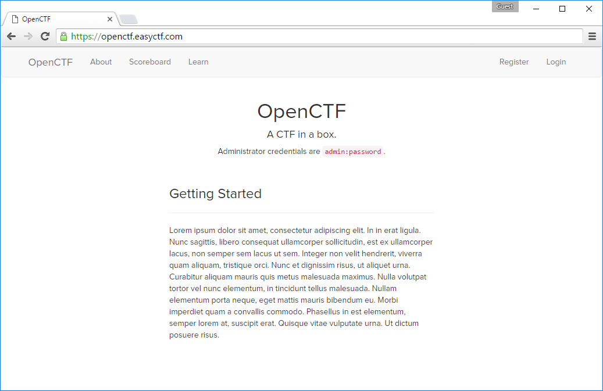

OpenCTF
======

Installation
------

You'll need [Docker](https://docker.com/) to set up OpenCTF. Make sure Docker is working correctly from the command line before you continue. This project uses Docker Compose to set up the platform. So to start the platform, simply run:

    docker-compose up -d

from the root folder of your project. This will bring up three Docker containers: `openctf`, the main controller that runs Nginx; `api`, the API server that runs a Flask API; and `mysql`, the database server that runs MySQL. If no problems occurred, you should be able to just navigate to the IP of your Docker machine in your browser, and it should greet you with the installation page. If you're unsure of what the IP of your Docker machine is, run `docker-machine env`.

Simply complete the in-browser installation, and you should be good to go! Note that you'll need to connect to your MySQL container to retrieve the verification code. Run `docker ps -a` to figure out the name of the machine running the MySQL instance, and then run

    docker exec -it <container_name> mysql -u"root" -p

replacing `<container_name>` with the name of the container you identified when you ran `docker ps -a`.

Tests
------

To run the tests, make sure you have the dependencies installed, and then run `py.test` in the root directory of the project to start the tests. Check `.travis.yml` for more details.

Issues
------

Please report issues in our [issue tracker](https://github.com/EasyCTF/OpenCTF/issues).

Contact
------

Please contact us through email at <team@easyctf.com>. You may optionally visit our [public Slack](http://slack.easyctf.com).
